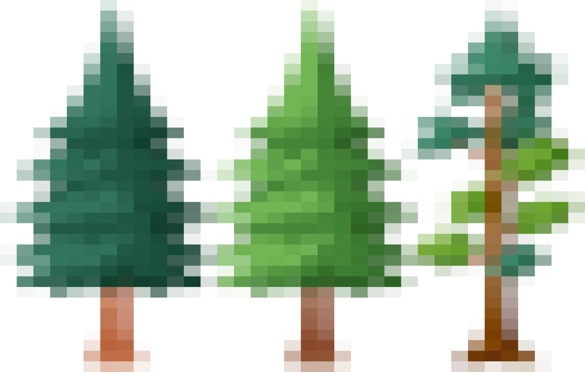

 

<h6 style="text-align: center;">Welcome to Forest Finder</h6>

 

 

                                                        
### About

Forest Finder is an R Shiny web app that allows users to dynamically explore forested areas 
throughout California's 58 counties. My original goal in making this 
application was to strategically identify new potential habitat where I could forage for edible mushroom
(an activity I look forward to doing when winter rains roll around). However, I realized that it could serve many 
more purposes beyond just foraging. I have since generalized the application to serve as
a mapping resource for nature enthusiasts to discover new forests for various outdoor recreations 
such as backpacking and hiking, birding, hunting, or simply just enjoying a walk in the woods. 
The purpose of Forest Finder is to helps us connect to our local California forests and enrich our 
interactions with wilderness. Regardless of how you use it, I appreciate constructive feedback 
on how to improve the user experience, so please contact me if you have questions or suggestions (email in the top right corner).
Forest Finder may grow, it may die, it may slowly evolve into something 
that it wasn't yesterday. I hope that it can serve you well as it has for me.

 
 

### How to use it

Forest Finder has a simple design to facilitate a user-friendly experience. A collapsible panel 
in the right hand corner on the *Interactive Map* page contains a series of widgets:

- `County`: select a California county  

- `Species`: select tree species or groups

- `Basemap`: select a map type 

 

After selecting your filters of interest, click `Find` and the map will populate predicted 
forested area (colored raster pixels) in that county by tree species/group inside of the county boundaries (red line). 
A legend will populate in the lower left hand corner that will link the tree species/groups to the associated color on the map.
This legend and the forested area can both be hidden using the `Legend` and `Trees` toggles. Furthermore, the `Basemap` type can 
be toggled to three different options. After a county raster with select species is mapped using the `Find` button, it can be downloaded 
as a *.tif* file by clicking the download symbol at the bottom left corner of the panel.

 

### Data

Forest Finder leverages data that was *predicted* by machine learning algorithms (ironically called *random forests*) by [Riley et a. 2021](https://www.fs.usda.gov/rds/archive/catalog/RDS-2021-0074) 
at the US Forest Service. All rights to its collection are given to the original authors and the [United States Forest Service (USFS)](https://www.fs.usda.gov/). 
All rasters are shown at a 60mx60m resolution in EPSG 3857 with the exception of large counties rendered in 90mx90m resolution (Fresno, Inyo, Kern, Lassen, Mono, Riverside, San Bernardino, Siskiyou). 
To read more about the original data set and related research, please see attached publication details on the United States Department of Agriculture [website](https://data.fs.usda.gov/geodata/rastergateway/treemap/index.php).

  

### Limitations

- The original published raster data has a resolution of 30mx30m. Resolution has been lowered to 60mx60m and 90mx90m to enhance the 
user experience by decreasing render time. While detail is lost in the resampling, the overall patterns in dominant forest type remain clear.

- Collected forest cover data is not 100% accurate. There are areas in real life with trees present where they aren't shown on the app and vice
versa. The data is robust enough to show broad patterns where you would typically find certain forested habitat.

- Data excludes areas where there were active fires prior to its collection in 2016

- Forest Finder does not distinguish between private and public land. It is the users responsibility to identify land ownership to mitigate trespassing.

  

### Citation

  <em>Riley, Karin L.; Grenfell, Isaac C.; Finney, Mark A.; Shaw, John D. 2021. TreeMap 2016: A tree-level model of the forests of the conterminous United States</em>
  
    <em>circa 2016. Fort Collins, CO: ForestService Research Data Archive.</em> 
    <a href="https://doi.org/10.2737/RDS-2021-0074">https://doi.org/10.2737/RDS-2021-0074</a>
  

  

