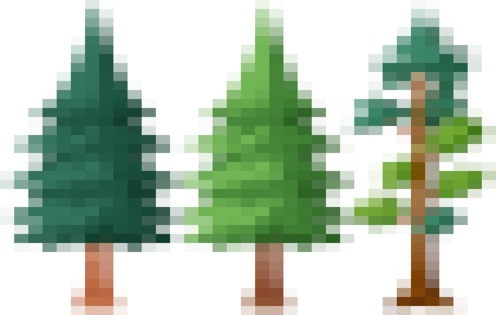

 

<h6 style="text-align: center;">Welcome to Forest Finder</h6>

 

 

                                                        
### About

Forest Finder is an app that allows individuals to dynamically explore forests 
throughout California's 58 counties by tree species or groups. My original goal in making this 
application was to strategically identify new locations where I could forage for edible mushroom
(an activity I look forward to doing when winter rains roll around). However, I realized that this
application could serve many more purposes beyond just foraging. I have since generalized the application to serve as
a mapping resource for nature enthusiasts to discover new locations for various outdoor recreations 
such as backpacking and hiking, birding, hunting, or simply just enjoying a walk in the woods. 
The idea is that Forest Finder can further connect us to our local California forests and enhance our ability
to interact with wilderness. Forest Finder may grow, it may die, it may slowly evolve into something that it
wasn't yesterday. Regardless of how you use it, I am always receptive to constructive feedback on how to improve the user 
experience, so feel free to contact me if you have questions or suggestions. I hope that it can serve you well as it has for me.

 

 

### How to use it

Forest Finder was not designed to be complex in it's nature. As of now, there are two inputs you can use to filter
forests of interests: `county` and `species`. The `county` option allows the user to select 1 of th 58 counties in
California to localize potential forested areas. The `species` filter allows users to select any or all of the tree 
species or groups that they are interested in with the ability to identify approximate areas of individual species. 
Between these two, you can get a sense of where different trees are hanging out which could indicate other ecological 
activity.  After selecting these two parameters, you click on `Apply` and the map wil populate with all selected predicted 
tree species and groups in that county.The map will populate a polygon of the selected county and display colored raster data 
of the forest types within it. A legend will populate in the lower left hand corner that will link the tree species/groups to 
the associated color on the map.

 

### Data

Data was collected by [Riley et a. 2021](https://www.fs.usda.gov/rds/archive/catalog/RDS-2021-0074), and all rights to the collection, curation, and research are given to the original authors 
Most counties retain their original 30mx30m resolution. However, larger rasters for heavily forested counties were resampled  to 60mx60m resolution to enhance the smoothness of the user 
experience in the application at the cost of some species detail. To read further on the data, please see attached publication details on the USDA website [HERE](https://data.fs.usda.gov/geodata/rastergateway/treemap/index.php).

  

### Limitations

This app leverages data that was *predicted* by machine learning algorithms (ironically called *random forests*) by researchers 
at the US Forest Service. It is not 100% accurate. There will be areas in real life with trees where they aren't shown on the app and vice
versa. The data is robust enough to show broad patterns by county where you would typically find certain forested habitat.
Furthermore, the app does not distinguish between private and public land. In many if not most cases, many of these forests
will be on private land, so it is the users responsibility to land ownership prior to embarking on an adventure.

  

### Citation

  <em>Riley, Karin L.; Grenfell, Isaac C.; Finney, Mark A.; Shaw, John D. 2021. TreeMap 2016: A tree-level model of the forests of the conterminous United States</em>
  
    <em>circa 2016. Fort Collins, CO: ForestService Research Data Archive.</em> 
    <a href="https://doi.org/10.2737/RDS-2021-0074">https://doi.org/10.2737/RDS-2021-0074</a>
  

  

